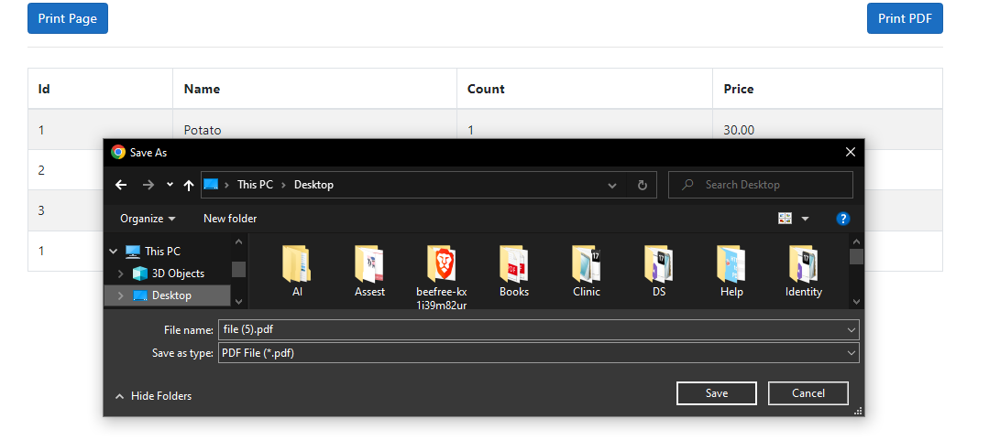

<hr/>

# Client-side HTML-to-PDF rendering using pure JS.

## 1- CDN
> The simplest way to use html2pdf.js is to include it as a script in your HTML by using cdnjs:

```bash
<script src="https://cdnjs.cloudflare.com/ajax/libs/html2pdf.js/0.10.1/html2pdf.bundle.min.js"></script>
```

## 2- Usage

>Once installed, html2pdf.js is ready to use. The following command will generate a PDF of #element-to-print and prompt the user to save the result:

```bash
 $("#PrintPDF").click(function () {
        var element = document.getElementById("ParentDiv")
        html2pdf().from(element).set().save();
    });
```
## 3-Test

<br/>

## Download

<a href="https://ekoopmans.github.io/html2pdf.js/">More Details...<a>
<hr/>

## Print Window
```bash
 <script>
 document.getElementById("btn-print").onclick = function () {
    debugger;
    // Select Area
    var area_id = document.getElementById("ParentDiv").innerHTML;
    // Select body 
    var body = document.body.innerHTML;
    document.body.innerHTML = area_id;
    window.print();
    document.body.innerHTML = body;
}
 </script>
```

```bash
$("#btn-print").click(function () {
        $("#ParentDiv").printThis();
         
    });
```
<a href="https://jasonday.github.io/printThis/">More Details about printThis.......</a>
